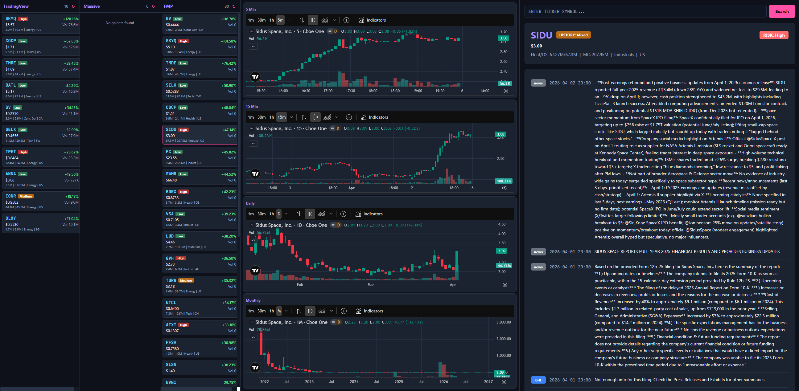
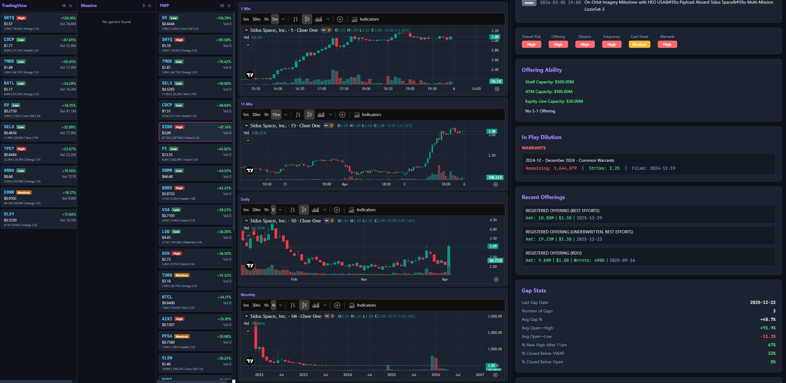

# Gap Lens Dilution

Real-time dilution risk dashboard for active traders. Pulls SEC filing data from AskEdgar V2, displays dilution analysis alongside live TradingView charts, and surfaces top gainers from three independent sources.

Adapted from [jasontange/Top-Gainers-Dilution-Monitor-V2-Public](https://github.com/jasontange/Top-Gainers-Dilution-Monitor-V2-Public), which is a desktop application (Electron/WPF). This project reimplements the concept as a full-stack web app (FastAPI + Next.js). Key differences from the original:

- **Web-native** — runs in the browser
- **3 gainer sources** — TradingView, Massive, and FMP side by side (original uses a single source)
- **4 simultaneous live charts** — 5min, 15min, Daily, and Monthly stacked in one view via TradingView embeds
- **AskEdgar V2 enterprise API** — full dilution analysis with risk badges, offering ability, in-play dilution, gap stats, and analyst notes

## Screenshots





## Architecture

```
┌───────────────────┐  ┌──────────────────┐  ┌─────────────────┐
│  Gainers Sidebar  │  │  TradingView     │  │  Dilution Data  │
│  TradingView +    │  │  Charts (4x)     │  │  Header, Risk,  │
│  Massive + FMP    │  │  5m/15m/D/M      │  │  Headlines, etc │
└───────────────────┘  └──────────────────┘  └─────────────────┘
         │                      │                      │
         └──────────────────────┼──────────────────────┘
                                │
                         ┌──────┴──────┐
                         │  FastAPI    │
                         │  Backend    │
                         └──────┬──────┘
                                │
                   ┌────────────┼────────────┐
                   │            │            │
             AskEdgar V2   TradingView   Massive / FMP
             (dilution)    (gainers)     (gainers)
```

- **Backend**: FastAPI at `app/` — proxies AskEdgar V2 enterprise API, TradingView gainers, Massive gainers, and FMP gainers
- **Frontend**: Next.js 16 at `frontend/` — single-page dashboard with 3-column layout
- **Charts**: TradingView Advanced Chart free embeds via CDN script injection (no API key needed)

## Running

### Backend

```bash
source venv/bin/activate
uvicorn app.main:app --host 0.0.0.0 --port 8000
```

### Frontend

Production builds are required for Tailscale access (dev server HMR websockets fail over non-localhost).

```bash
cd frontend
npx next build
npx next start -p 3001 -H 0.0.0.0
```

Access at `http://100.70.21.69:3001` (Tailscale IP).

### Environment

Backend API keys in `.env`:
```
ASKEDGAR_API_KEY=<your-key>
MASSIVE_API_KEY=<your-key>
FMP_API_KEY=<your-key>
```

Frontend API base URL in `frontend/.env.local`:
```
NEXT_PUBLIC_API_BASE=http://100.70.21.69:8000
```

## API Endpoints

| Endpoint | Description |
|----------|-------------|
| `GET /health` | Health check |
| `GET /api/v1/dilution/{ticker}` | Full dilution analysis from AskEdgar V2 |
| `GET /api/v1/gainers` | TradingView top gainers |
| `GET /api/v1/gainers/massive` | Massive top gainers |
| `GET /api/v1/gainers/fmp` | FMP top gainers |

## Frontend Components

| Component | Purpose |
|-----------|---------|
| `Header` | Ticker, price, float/OS/MC, risk badge, chart analysis |
| `Headlines` | SEC filings and news with filing-type badges |
| `RiskBadges` | Overall, offering, dilution risk indicators |
| `OfferingAbility` | ATM/shelf registration status |
| `InPlayDilution` | Active warrants and convertible notes |
| `Offerings` | Historical offering table |
| `GapStats` | Gap fill statistics |
| `JMT415Notes` | Analyst notes |
| `MgmtCommentary` | Management commentary |
| `Ownership` | Institutional/insider ownership |
| `TradingViewChart` | Live TradingView chart embed (CDN script injection) |
| `GainerPanel` | Scrollable gainer list with auto-refresh |
| `TickerSearch` | Ticker search bar |

## Layout

3-column layout filling the browser viewport:

1. **Left sidebar** (fixed width) — triple gainer panels (TradingView + Massive + FMP) with auto-refresh
2. **Middle column** (flex) — 4 stacked TradingView charts (5min, 15min, Daily, Monthly), no scroll, fills viewport height
3. **Right column** (flex) — ticker search, dilution data components, scrollable

## Tech Stack

- **Backend**: Python 3.12, FastAPI, httpx, Pydantic
- **Frontend**: Next.js 16, React 19, Tailwind CSS 4, TypeScript
- **Charts**: TradingView Advanced Chart (free embed widget)
- **Data**: AskEdgar V2 (dilution), TradingView (gainers), Massive/Polygon (gainers), FMP (gainers)
- **Testing**: pytest, Playwright (Python)
- **Deployment**: Tailscale (production builds only)

## Tests

```bash
# Backend API tests
python3 -m pytest tests/test_api.py -v

# TradingView chart widget Playwright tests
python3 -m pytest tests/test_tradingview_chart.py -v
```
