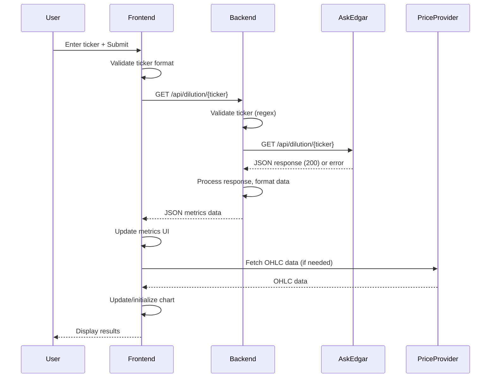
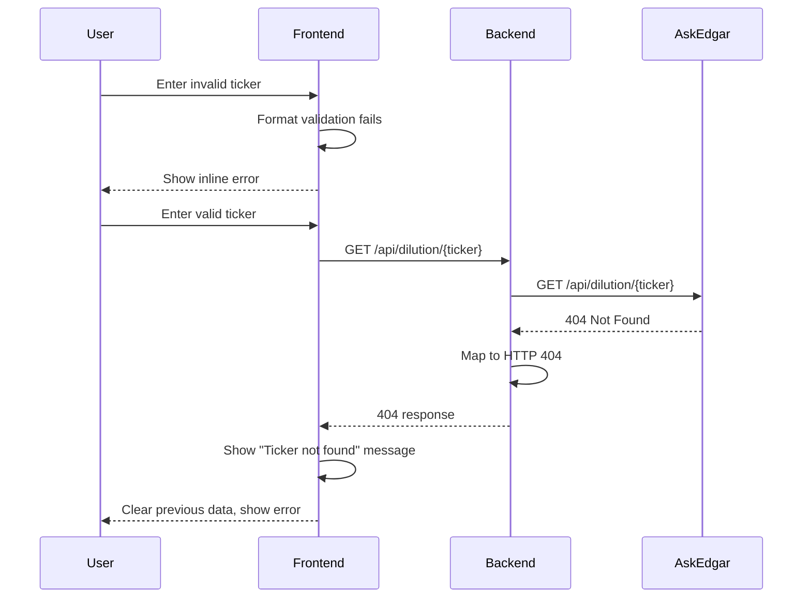

# Gap Lens Dilution — Architecture Document

**Document:** 02-ARCHITECTURE.md  
**Project:** gap-lens-dilution  
**Version:** 1.0  
**Date:** 2026-03-30  
**Generated By:** architect  
**Status:** Draft

---

## 1. System Overview

Gap Lens Dilution is a standalone web application consisting of:
- **Backend:** FastAPI application serving API endpoints and static frontend assets
- **Frontend:** Vanilla JavaScript application consuming backend APIs and rendering UI
- **External Services:** 
  - Ask-Edgar API for dilution risk metrics
  - Price data provider (TBD) for OHLC candlestick data
- **Design System:** Gap Research design tokens implemented via CSS variables

The application follows a client-server architecture where the frontend runs in the browser and communicates with the backend via RESTful APIs. The backend acts as a proxy to external APIs and serves static assets.

---

## 2. Architectural Goals

1. **Separation of Concerns:** Clear division between backend logic, frontend presentation, and data access layers
2. **Modularity:** Components designed for easy extraction into shared library
3. **Maintainability:** Clean code organization with clear interfaces
4. **Scalability:** Stateless backend ready for horizontal scaling
5. **Performance:** Efficient data fetching and caching strategies
6. **Resilience:** Comprehensive error handling and fallback mechanisms
7. **Design Compliance:** Strict adherence to Gap Research design system

---

## 3. High-Level Architecture

```
┌─────────────────┐    ┌──────────────────┐    ┌────────────────────┐
│   Browser       │    │   FastAPI        │    │   External APIs    │
│   (Frontend)    │◄──►│   (Backend)      │◄──►│   (Ask-Edgar,      │
│                 │    │                  │    │    Price Provider) │
└─────────────────┘    └──────────────────┘    └────────────────────┘
         ▲                      ▲
         │ HTTP/JSON            │ HTTP/JSON
         │                      │
┌─────────────────┐    ┌──────────────────┐
│   Static Assets │    │   Business Logic │
│   (HTML/CSS/JS) │    │   (Services)     │
└─────────────────┘    └──────────────────┘
```

### 3.1 Backend Architecture

The FastAPI backend consists of:

1. **API Layer:** Route definitions and request/response handling
2. **Service Layer:** Business logic and external API integration
3. **Utility Layer:** Helper functions, data formatting, error handling
4. **Configuration:** Environment-based settings
5. **Static File Serving:** Frontend asset delivery

### 3.2 Frontend Architecture

The frontend follows a component-based pattern using vanilla JavaScript:

1. **View Components:** DOM elements and UI rendering
2. **Service Layer:** API communication and data processing
3. **State Management:** Application state (loading, errors, data)
4. **Utilities:** Formatting helpers, validation, event handling
5. **Chart Component:** TradingView Lightweight Charts integration

### 3.3 Data Flow

1. User enters ticker symbol in input field
2. Frontend validates input format
3. On submit, frontend displays loading state
4. Frontend calls backend API endpoint `/api/dilution/{ticker}`
5. Backend validates ticker and calls Ask-Edgar API
6. Backend processes response, applies formatting, returns JSON
7. Frontend receives data, updates UI components
8. Frontend initializes/updates TradingView chart with price data
9. Error states handled appropriately at each layer

---

## 4. Component Structure

### 4.1 Backend Structure

```
gap-lens-dilution/
├── app/
│   ├── __init__.py
│   ├── main.py                 # FastAPI app creation and middleware
│   ├── api/
│   │   ├── __init__.py
│   │   ├── v1/
│   │   │   ├── __init__.py
│   │   │   ├── routes.py       # API route definitions
│   │   │   └── deps.py         # Dependencies (DB, etc.)
│   │   └── __init__.py
│   ├── core/
│   │   ├── __init__.py
│   │   ├── config.py           # Configuration management
│   │   └── security.py         # Security utilities
│   ├── services/
│   │   ├── __init__.py
│   │   ├── dilution.py         # Ask-Edgar integration
│   │   └── price.py            # Price data provider (stub)
│   ├── utils/
│   │   ├── __init__.py
│   │   ├── formatting.py       # Number/currency formatting
│   │   ├── validation.py       # Input validation
│   │   └── errors.py           # Custom exceptions
│   └── static/                 # Frontend static assets
│       ├── css/
│       │   ├── styles.css
│       │   └── design-tokens.css
│       ├── js/
│       │   ├── main.js         # Application entry point
│       │   ├── components/
│       │   │   ├── input.js
│       │   │   ├── metrics-card.js
│       │   │   ├── share-structure.js
│       │   │   └── chart.js
│       │   ├── services/
│       │   │   ├── api.js      # Backend API client
│       │   │   └── chart.js    # TradingView wrapper
│       │   ├── state.js        # Application state management
│       │   └── utils/
│       │       ├── formatters.js
│       │       └── validators.js
│       └── index.html
├── tests/
├── requirements.txt
├── .env
└── README.md
```

### 4.2 Frontend Components

1. **Input Component:** Ticker entry with validation and submit handling
2. **Metrics Card Component:** Displays dilution risk metrics with color coding
3. **Share Structure Component:** Shows float, outstanding, ownership percentages
4. **Chart Component:** TradingView candlestick chart with volume and controls
5. **Loading/Error States:** UI elements for async operations and error display

### 4.3 Service Layers

**Backend Services:**
- `dilution.service`: Handles Ask-Edgar API communication, retry logic, response parsing
- `price.service`: Stub for price data provider integration (to be implemented)

**Frontend Services:**
- `api.service`: Wrapper for backend API endpoints with error handling
- `chart.service`: Encapsulates TradingView chart initialization and updates

### 4.4 Data Models

**Backend Pydantic Models:**
- `DilutionResponse`: Matches Ask-Edgar API response structure
- `FormattedMetrics`: Processed data ready for frontend consumption
- `ErrorResponse`: Standardized error format

**Frontend Data Structures:**
- `TickerState`: { symbol, loading, error, data }
- `ChartConfig`: Timeframe options and chart settings

---

## 5. API Integration Patterns

### 5.1 Backend to External APIs

#### Ask-Edgar Integration
- **Endpoint:** `https://ask-edgar.com/api/dilution/{ticker}` (example)
- **Method:** GET
- **Authentication:** API key in header (`X-API-Key`)
- **Retry Logic:** Exponential backoff for 5xx errors
- **Rate Limiting:** Respect 429 responses with retry-after header
- **Caching:** In-memory cache per request session (no redundant calls)
- **Error Mapping:** Convert external errors to appropriate HTTP status codes

#### Price Data Provider (TBD)
- To be implemented based on selected provider
- Similar pattern: abstraction layer, error handling, caching

### 5.2 Frontend to Backend

**Endpoints:**
- `GET /api/dilution/{ticker}` - Returns formatted dilution metrics
- `GET /static/{path}` - Serves frontend assets (handled by FastAPI static files)

**Request/Response Format:**
- JSON for all API communication
- Standard HTTP status codes
- Consistent error response structure

### 5.3 Error Handling Patterns

**Backend:**
- Catch external API exceptions and map to HTTP 502/504
- Validate ticker format before external calls (400 for invalid)
- Log all external API errors with context
- Return standardized error JSON:
  ```json
  {
    "error": {
      "code": "TICKER_NOT_FOUND",
      "message": "Ticker 'XYZ' not found",
      "details": {}
    }
  }
  ```

**Frontend:**
- Display user-friendly error messages based on error code
- Retry mechanisms for transient errors
- Clear previous data on new requests
- Loading states during API calls

---

## 6. Data Flow Details

### 6.1 Request Processing Flow



### 6.2 Error Flow



---

## 7. Technology Stack Justification

### 7.1 Backend: FastAPI
- **Why:** Modern, high-performance Python framework with automatic OpenAPI docs
- **Benefits:** Type hints, dependency injection, async support, easy testing
- **Alternatives Considered:** Flask (less performant), Django (overkill)

### 7.2 Frontend: Vanilla JavaScript
- **Why:** No build step required, lightweight, full control over DOM
- **Benefits:** Zero dependencies, easy to extract as library, fast loading
- **Alternatives Considered:** React/Vue (overhead for simple app), Svelte (build step)

### 7.3 Charting: TradingView Lightweight Charts
- **Why:** Professional financial charts, lightweight, MIT license
- **Benefits:** Candlestick/volume series, interactive features, themeable
- **Alternatives Considered:** Chart.js (less financial-specific), Plotly (heavier)

### 7.4 Design System: CSS Variables
- **Why:** Easy theming, consistent with Gap Research tokens
- **Benefits:** No CSS-in-JS overhead, easy to override, browser-native
- **Implementation:** `:root` variables in CSS, referenced throughout

### 7.5 Deployment: Uvicorn
- **Why:** ASGI server optimized for FastAPI
- **Benefits:** Async support, production-ready, easy to containerize
- **Alternatives Considered:** Gunicorn+Uvicorn workers (for scaling)

---

## 8. Configuration Management

### 8.1 Environment Variables
- `ASKEDGAR_API_KEY`: Authentication for Ask-Edgar API
- `PRICE_API_KEY`: Key for price data provider (when implemented)
- `API_RATE_LIMIT_PER_DAY`: Configurable rate limit (default 50)
- `REQUEST_TIMEOUT_SECONDS`: External API timeout (default 10)
- `CACHE_TTL_SECONDS`: Internal cache duration (default 300)
- `LOG_LEVEL`: Logging verbosity (INFO/DEBUG)
- `HOST`: Server host (default 0.0.0.0)
- `PORT`: Server port (default 8000)

### 8.2 Configuration Pattern
- Pydantic BaseSettings for type validation and environment loading
- Centralized config module imported throughout application
- Default values for development, overrides via .env or system env

---

## 9. Performance Considerations

### 9.1 Backend Optimizations
- Async HTTP client (httpx) for external API calls
- Connection pooling for external services
- In-memory caching with TTL for repeated ticker requests
- Request deduplication using memoization
- Efficient JSON serialization with Pydantic models

### 9.2 Frontend Optimizations
- Debounce input validation (300ms)
- Cancel previous API requests on new input
- Minimize DOM updates with document fragments
- Lazy load non-critical CSS/JS
- Efficient chart updates (only update data, not recreate)

### 9.3 Network Optimization
- Gzip compression for API responses
- Browser caching for static assets (via Cache-Control headers)
- Minify CSS/JS in production
- Preload critical fonts (Space Grotesk, JetBrains Mono)

---

## 10. Security Measures

### 10.1 Input Validation
- Server-side ticker validation (regex: `^[A-Z]{1,5}$`)
- Sanitization: uppercase conversion, whitespace trimming
- Length limiting (max 8 characters)
- Rejection of special characters and numbers

### 10.2 API Security
- CORS restricted to frontend origin
- Rate limiting on backend endpoints (per IP)
- API keys stored in environment variables (never in code)
- HTTPS enforced in production
- Security headers (X-Frame-Options, X-Content-Type-Options)

### 10.3 Data Protection
- No persistent storage of user data
- API keys never logged or exposed in errors
- Error messages sanitized before returning to user
- Secure handling of external API responses

---

## 11. Error Handling & Logging

### 11.1 Error Classification
- **Client Errors (4xx):** Invalid ticker, rate limit exceeded
- **Server Errors (5xx):** External API failure, internal processing error
- **Network Errors:** Timeout, connection refused, DNS failure

### 11.2 Logging Strategy
- Structured JSON logging for production
- Development: human-readable console logging
- Log levels: DEBUG (dev), INFO (prod), WARN, ERROR
- Log context: request ID, ticker, user agent, timestamp
- External API errors logged with full response details (sans API keys)

### 11.3 User Feedback
- Inline validation errors for input field
- Toast-style notifications for transient errors
- Persistent error cards for API failures
- Clear actions: "Retry", "Try different ticker"
- Technical details hidden from users, available in logs

---

## 12. Extensibility & Future Integration

### 12.1 Backend Extension Points
- **Service Layer:** Easy to add new data providers (social sentiment, news)
- **Plugin Architecture:** Routes defined via registerable routers
- **Dependency Injection:** Services replaceable for testing/mocks
- **Middleware:** Auth, logging, metrics collection hooks

### 12.2 Frontend Extension Points
- **Component Registry:** Easy to add new UI components
- **Service Abstraction:** API client adaptable to different backends
- **Chart Plugin System:** Technical indicators, drawing tools
- **State Management:** Migration path to Redux/Zustand if needed

### 12.3 Design for Platform Extraction
- Clear separation between app-specific and reusable components
- Service interfaces defined for easy extraction
- Configuration externalized for different deployments
- API versioning path established (/api/v1/*)

---

## 13. Testing Strategy

### 13.1 Backend Testing
- **Unit Tests:** Service layer utilities, validation, formatting
- **Integration Tests:** API endpoints with mocked external services
- **Contract Tests:** Verify OpenAPI specification matches implementation
- **Load Tests:** Simulate concurrent ticker requests
- **Tools:** pytest, httpx.AsyncClient, respx for mocking

### 13.2 Frontend Testing
- **Unit Tests:** Utility functions (formatters, validators)
- **Integration Tests:** Component interactions with mocked API
- **E2E Tests:** Critical user flows (ticker search -> results)
- **Visual Regression:** CSS/theme consistency checks
- **Tools:** Vitest, jsdom, Playwright/Cypress

### 13.3 Test Coverage Goals
- Backend: 80%+ line coverage
- Frontend: 70%+ line coverage (focus on complex logic)
- Critical paths: 90%+ coverage (input validation, error handling)

---

## 14. Deployment Considerations

### 14.1 Development
- Hot reload with `uvicorn app.main:app --reload`
- Environment: `.env.dev` file
- Database: None required (Phase 1)
- Frontend: Served directly from static directory

### 14.2 Production
- Process manager: systemd or Docker
- Reverse proxy: Nginx (SSL termination, static file caching)
- Workers: 2-4 Uvicorn workers based on CPU cores
- Monitoring: Health check endpoint (`/health`)
- Logging: JSON to stdout, forwarded to logging system

### 14.3 Containerization (Optional)
- Dockerfile based on python:3.10-slim
- Multi-stage build for smaller image
- Non-root user for security
- Healthcheck instruction in Dockerfile

---

## 15. Open Questions & Decisions Needed

1. **Price Data Source:** Selection pending (Yahoo Finance, Alpha Vantage, Polygon.io)
   - Affects: price.service implementation, API key management
   - Decision needed before frontend chart component completion

2. **Ask-Edgar Rate Limits:** Exact limits and retry strategy
   - Affects: backend service retry logic, user messaging
   - Need to confirm with API documentation

3. **Design System Assets:** Location of Gap Research CSS/fonts
   - Affects: static asset setup, CSS variable definitions
   - Need to verify if provided via CDN or local copy

4. **Deployment Target:** Local dev, cloud VM, or containerized?
   - Affects: infrastructure documentation, DevOps steps
   - Decision impacts scaling and monitoring approach

5. **Error Logging Service:** Consider Sentry or similar?
   - Affects: production observability
   - Optional for Phase 1, can be added later

---

## 16. Conclusion

This architecture provides a solid foundation for the Gap Lens Dilution dashboard that:
- Meets all Phase 1 requirements from 01-REQUIREMENTS.md
- Follows Gap Research design system compliance
- Ensures separation of concerns and modularity
- Implements robust error handling and security practices
- Considers performance and scalability from the outset
- Provides clear paths for future enhancements and platform integration

The component structure and data flow patterns are designed to be intuitive for developers while maintaining the simplicity required for a focused MVP.

---

**Status:** READY FOR REVIEW  
**Next Step:** UI specification (03-UI-SPEC.md)
